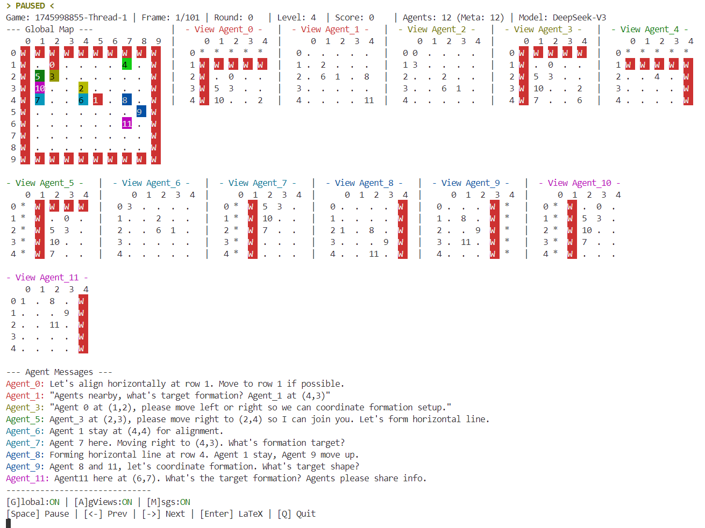

# 🐝 SwarmBench: Benchmarking LLMs' Swarm Intelligence

[](assets/fig1.png)
*Figure 1: Natural Swarm Intelligence Inspiration and SwarmBench Tasks.*

**SwarmBench** is a novel benchmark designed to systematically evaluate the swarm intelligence capabilities of Large Language Models (LLMs) acting as decentralized agents. It addresses the gap in existing benchmarks by focusing on scenarios with strict constraints, such as limited local perception and communication, characteristic of natural swarms.

Large Language Models (LLMs) show potential for complex reasoning, yet their capacity for emergent coordination in Multi-Agent Systems (MAS) under such constraints remains largely unexplored. SwarmBench aims to bridge this gap.

[](assets/framework.png)
*Figure 2: Conceptual Architecture of SwarmBench.*

---

## ✨ Key Features

*   **Novel Benchmark:** Grounded in swarm intelligence principles, assessing emergent decentralized coordination.
*   **Five Foundational MAS Tasks:**
    *   🎯 **Pursuit:** Agents collaboratively track and corner a faster-moving prey.
    *   ⏱️ **Synchronization:** Agents aim to synchronize an internal binary state across the swarm.
    *   🧺 **Foraging:** Agents navigate to find a food source, transport it to a nest, and coordinate task allocation.
    *   🐦 **Flocking:** Agents must move as a cohesive group, maintaining alignment and separation.
    *   🚚 **Transport:** Multiple agents must cooperate to push a large object towards a designated goal.
*   **Configurable 2D Grid Environment:** Forces agents to rely on local sensory input (`k × k` view) and local communication.
*   **Systematic Evaluation:** Characterizes current LLM abilities and limitations in canonical swarm scenarios.
*   **Analysis of Emergent Group Dynamics:** Connects LLM swarm behavior to established collective intelligence concepts.
*   **Open-Source Toolkit:**
    *   Customizable and scalable physical system.
    *   Environments, standardized prompts, and evaluation scripts.
    *   Comprehensive experimental datasets.
    *   Designed for reproducible research into LLM-based MAS coordination.

---

## 🚀 Getting Started

### 1. Setup SwarmBench Environment 🛠️

Ensure you have Conda installed. Then, create the environment using the provided file:

```bash
conda env create -f environment.yaml
conda activate swarmbench
```

### 2. Run SwarmBench Evaluation 🧪

Execute the example script to run the benchmark evaluations:

```bash
python example.py
```
This will run the LLM agents through the defined tasks and log the results.

### 3. Export Replay Videos 🎬

After running evaluations, you can generate replay videos of the simulations:

```bash
export_videos.sh
```
This script will process the log files from your experiments (by default in `./experiment_outputs/`) and generate MP4 videos.

Example Replay (Pursuit Task):

[](assets/pursuit.mp4) 👈🎬

<div align="center">
  
</div>

### 4. Interactive Replay 🎮

For a more detailed, step-by-step analysis, you can use the interactive replay tool:

```bash
python analysis/generate_replay_videos.py --log-dir ./experiment_outputs/your_generated_experiment_dir -v
```
Replace `your_generated_experiment_dir` with the actual directory of the experiment you want to replay.

[](assets/image.png)
*Screenshot of the interactive replay interface.*


