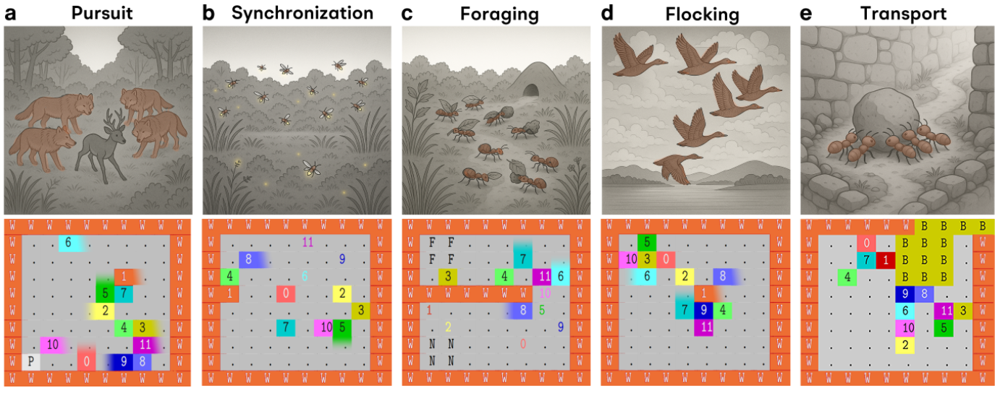
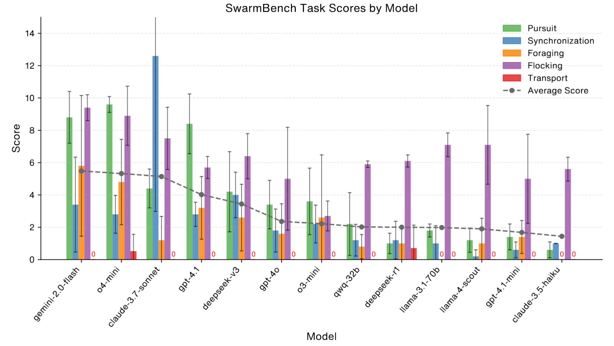

# 🐝 SwarmBench (*YuLan-SwarmIntell*): Benchmarking LLMs' Swarm Intelligence

[](https://arxiv.org/abs/2505.04364)

[](https://huggingface.co/datasets/6cf/swarmbench)


[](assets/fig1.png)

*Figure 1: Natural Swarm Intelligence Inspiration and SwarmBench Tasks.*

**SwarmBench** is a novel benchmark designed to systematically evaluate the swarm intelligence capabilities of Large Language Models (LLMs) acting as decentralized agents. It addresses the gap in existing benchmarks by focusing on scenarios with strict constraints, such as limited local perception and communication, characteristic of natural swarms.

Large Language Models (LLMs) show potential for complex reasoning, yet their capacity for emergent coordination in Multi-Agent Systems (MAS) under such constraints remains largely unexplored. SwarmBench aims to bridge this gap.

[](assets/framework.png)

*Figure 2: Conceptual Architecture of SwarmBench.*



*Figure 3: Overview of LLM Performance on SwarmBench Tasks*

---

## ✨ Key Features

*   **Novel Benchmark:** Grounded in swarm intelligence principles, assessing emergent decentralized coordination.
*   **Five Foundational MAS Tasks:**
    *   🎯 **Pursuit:** Agents collaboratively track and corner a faster-moving prey.
    *   ⏱️ **Synchronization:** Agents aim to synchronize an internal binary state across the swarm.
    *   🧺 **Foraging:** Agents navigate to find a food source, transport it to a nest, and coordinate task allocation.
    *   🐦 **Flocking:** Agents must move as a cohesive group, maintaining alignment and separation.
    *   🚚 **Transport:** Multiple agents must cooperate to push a large object towards a designated goal.
*   **Configurable 2D Grid Environment:** Forces agents to rely on local sensory input (`k × k` view) and local communication.
*   **Systematic Evaluation:** Characterizes current LLM abilities and limitations in canonical swarm scenarios.
*   **Analysis of Emergent Group Dynamics:** Connects LLM swarm behavior to established collective intelligence concepts.
*   **Open-Source Toolkit:**
    *   Customizable and scalable physical system.
    *   Environments, standardized prompts, and evaluation scripts.
    *   Comprehensive experimental datasets.
    *   Designed for reproducible research into LLM-based MAS coordination.

---

## 🚀 Getting Started

### 🛠️ 1. Setup SwarmBench Environment 

Ensure you have Conda installed. Then, create the environment using the provided file:

```bash
conda env create -f environment.yaml
conda activate swarmbench
```

### 🧪 2. Run SwarmBench Evaluation 

Execute the `eval.py` script to run the benchmark evaluations:

```bash
python eval.py
```

```python
from swarmbench import SwarmFramework

if __name__ == '__main__':
    name = 1
    for task in ('Transport', 'Pursuit'): #####  {'Transport', 'Pursuit', 'Synchronization', 'Foraging', 'Flocking'}
        for model in ('gpt-4o-mini', 'llama-3.1-70b'): ##### Models
            for seed in (27, 42):
                SwarmFramework.submit(
                    f'exp_{name}',
                    SwarmFramework.model_config(model, 'YOUR_API_KEY', 'YOUR_API_BASE'), ##### API
                    task,
                    log_dir='YOUR_LOG_DIR', ##### Logging
                    num_agents=10,
                    max_round=100,
                    width=10,
                    height=10,
                    seed=seed,
                    view_size=5
                )
                name += 1

    SwarmFramework.run_all(max_parallel=4)
```

This will run the LLM agents through the defined tasks and log the results.

### 🤗 3. Or Download SwarmBench Dataset Directly

```bash
python load_dataset.py
```


### 🎬 4. Export Replay Videos 

After running evaluations, you can generate replay videos of the simulations:

```bash
./export_videos.sh
```
This script will process the log files from your experiments (by default in `./experiment_outputs/`) and generate MP4 videos.

Example Replay:

## 🐝🎬 Pursuit

o4-mini, the best out of 5 runs.

[](assets/Pursuit_o4-mini_best.gif) 

## 🐝🎬 Synchronization

o4-mini, the best out of 5 runs.

[](assets/Synchronize_o4-mini_best.gif) 

## 🐝🎬 Foraging

o4-mini, the best out of 5 runs.

[](assets/Foraging_o4-mini_best.gif) 

## 🐝🎬 Flocking

o4-mini, the best out of 5 runs.

[](assets/Flocking_o4-mini_best.gif) 

## 🐝🎬 Transport

o4-mini, the best out of 5 runs.

[](assets/Transport_o4-mini_best.gif) 


### 🎮 5. Interactive Replay 

For a more detailed, step-by-step analysis, you can use the interactive replay tool:

```bash
python analysis/replay_interactive_latex.py -v --log-dir your_experiment_dir 
```
Replace `your_experiment_dir` with the actual directory of the experiment you want to replay.

[](assets/interactive.gif)

*Screenshot of the interactive replay interface.*

### 📊 6. Export Leaderboard 

```bash
python analysis/score_agg.py --log-dir your_experiment_dir
```

You will get output like this:

```bash
Model                       | Avg Score | ± Std Dev | Games
-----------------------------------------------------------
o4-mini                     |      9.60 |    ± 0.49 |     5
gemini-2.0-flash            |      8.80 |    ± 1.60 |     5
gpt-4.1                     |      8.40 |    ± 1.85 |     5
claude-3-7-sonnet-20250219  |      4.40 |    ± 1.20 |     5
DeepSeek-V3                 |      4.20 |    ± 2.48 |     5
o3-mini                     |      3.60 |    ± 2.06 |     5
gpt-4o                      |      3.40 |    ± 1.50 |     5
qwen/qwq-32b                |      2.20 |    ± 1.94 |     5
Meta-Llama-3.1-70B-Instruct |      1.80 |    ± 0.40 |     5
gpt-4.1-mini                |      1.40 |    ± 0.80 |     5
meta-llama/llama-4-scout    |      1.20 |    ± 0.75 |     5
deepseek-ai/DeepSeek-R1     |      1.00 |    ± 0.63 |     5
claude-3-5-haiku-20241022   |      0.60 |    ± 0.49 |     5
-----------------------------------------------------------
```


### 📈 7. Export Score & Metric Progression Plots 


Run this script to export the plots. The output will be saved in `./figs`

```
./export_metrics_plots.sh
```

[](assets/fig3.png)

### 📈 8. Export Score Trends for Each Task

For a single task:

```bash
python analysis/task_score_trends.py --log-dir experiment_v01 --pad-rounds 100
```

For multiple tasks:

```bash
python analysis/task_score_trends.py --log-dir experiment_v01 experiment_v02 experiment_v03 experiment_v04 experiment_v05 --multi-plot --pad-rounds 100
```

[](assets/fig4.png)

## ☑️ Future Plans
Here's a list of some stuff that will be added to the codebase!

- [ ] Add RLVR training & testing code
- [ ] RLVR trained small model for demo
- [x] Include full dataset

## 🤝 Contributing to SwarmBench

We enthusiastically welcome community contributions to SwarmBench! If you're passionate about advancing research in LLM swarm intelligence, we invite you to help improve the benchmark by proposing new tasks, implementing features, etc. Your insights are highly valued. For significant intellectual contributions that substantially advance the project, we are open to exploring collaborative opportunities on future research and potential academic publications, in line with standard academic practices. Please engage with us via GitHub Issues for discussions and submit Pull Requests for your contributions.

# BibTeX

```bibtex
@article{ruan2025benchmarkingllmsswarmintelligence,
      title={Benchmarking LLMs' Swarm intelligence}, 
      author={Kai Ruan and Mowen Huang and Ji-Rong Wen and Hao Sun},
      year={2025},
      eprint={2505.04364},
      archivePrefix={arXiv},
      primaryClass={cs.MA},
      url={https://arxiv.org/abs/2505.04364}, 
}
```
